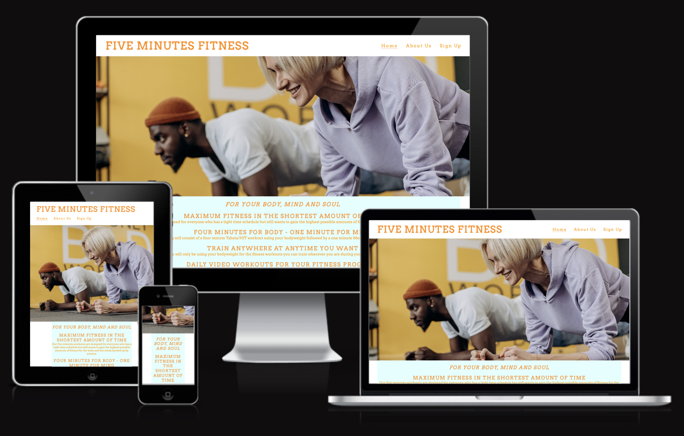
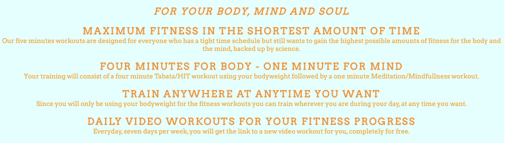
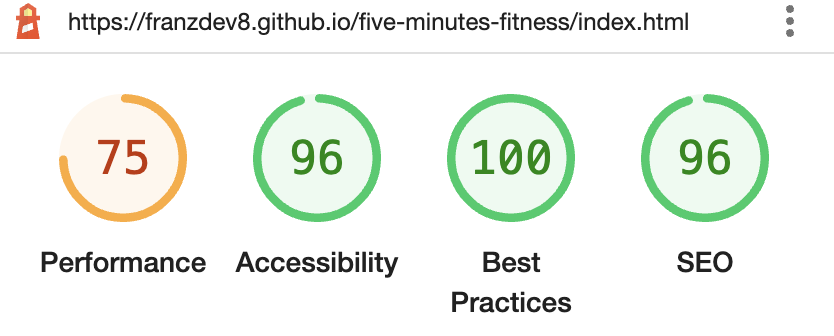
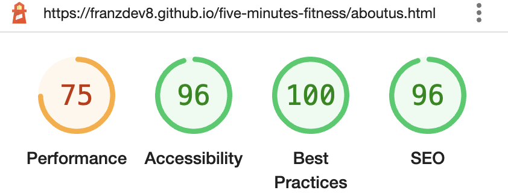
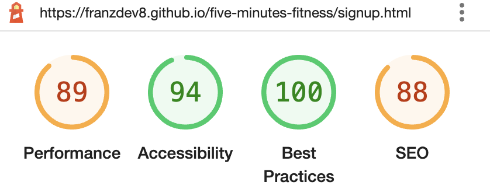

## Five Minutes Fitness

Five Minutes Fitness is a website providing short workouts for a community with a tight time schedule.

The website is aimed at people who want effective and efficient workouts for the body, mind and soul. All workouts consit of a four minute bodywheight and a one minute mindfullness workout and are sent via link to the user completly for free.

On the homepage users will find informations about the concept of the site as well as an overview about the creators of the self-development service. It is also possible to sign up to the free fitness service from there.

## Features 

- __Navigation Bar__

- At the left top of the page there is the website logo FIVE MINUTES FITNESS that links to the top of the home page.
- At the right top of the page (when you are looking on a smaller device, beneath the logo) there are links to Home, About Us and Sign Up. With those you can navigate to different pages on the website. 
- Screen shots of logo and menu links are below.
- In the footer on the bottom of the page  are icons for different social media portals, these are links that will open the respective social media in a new tab when clicked on.

- __The Landing Page Picture__ 

  - The home section of the page includes a image of a woman and a man working out together.
  - The concept of the website is supposed to be made visible by this.

- __The for your Body, Mind and Soul section__ 

- This section provides the informations about the concept and the conditons of the website.
- The explinations of the concept give a detailed overview about the free fitness-service.

     

- __The About Us section__ 

 - The information about the anonymous providers of the free fitness-service can be found here. 
 - A detailed explination of the reasons for offering such a usefull service for free are given there as well.

- __The Sign Up section__ 

  - This page gives the user the opportunity to get signed up to Five Minutes Fitness in order to start their personel development. 
  - It is mandatory to submit the full name and a email address.

 

- __The Footer__ 

  At the footer there are links to social media sites for Five Minutes Fitness. The links will open to a new tab to allow easy navigation for the user. 
  - The footer is of use for the visitor of the page as it encourages them to keep following the social media accounts of the site. 
  - Also included is the contact information for the user.

 

## Testing 

- It was tested by me that this site works in different browsers: Chrome, Safari and Firefox.
- I confirmed that the site is responsive and looks good on different devices by using devtools device toolbar.
- I confirmed that the different pages on the site are all simple to understand and simple to read.
- I have confirmed that the form works, and also that all input entries except for the textarea element are required. 

### Validator Testing 

- HTML
  - No errors were returned when passing through the official [W3C validator](https://validator.w3.org/nu/?doc=https%3A%2F%2Fcode-institute-org.github.io%2Flove-running-2.0%2Findex.html)
- CSS
  - No errors were found when passing through the official [(Jigsaw) validator](https://jigsaw.w3.org/css-validator/validator?uri=https%3A%2F%2Fvalidator.w3.org%2Fnu%2F%3Fdoc%3Dhttps%253A%252F%252Fcode-institute-org.github.io%252Flove-running-2.0%252Findex.html&profile=css3svg&usermedium=all&warning=1&vextwarning=&lang=en#css)

- Accessibility
  - I confirmed that the chosen fonts and colors are accessable using lighthouse in devtools.
   
  - Home page

   

  - About Us page

   

  - Sign Up page

   

### Bugs

-  No unfixed bugs were found in the project.

## Deployment

This section should describe the process you went through to deploy the project to a hosting platform (e.g. GitHub) 

- The site was deployed to GitHub pages. The steps to deploy are as follows: 
  - In the GitHub repository, navigate to the Settings tab 
  - From the source section drop-down menu, select the Master Branch
  - Once the master branch has been selected, the page will be automatically refreshed with a detailed ribbon display to indicate the successful deployment. 

The live link can be found here - https://code-institute-org.github.io/love-running-2.0/index.html 

## Credits 

In this section you need to reference where you got your content, media and extra help from. It is common practice to use code from other repositories and tutorials, however, it is important to be very specific about these sources to avoid plagiarism. 

You can break the credits section up into Content and Media, depending on what you have included in your project. 

### Content 

- The text for the Home page was taken from Wikipedia Article A
- Instructions on how to implement form validation on the Sign Up page was taken from [Specific YouTube Tutorial](https://www.youtube.com/)
- The icons in the footer were taken from [Font Awesome](https://fontawesome.com/)

### Media

- The photos used on the home and sign up page are from This Open Source site
- The images used for the gallery page were taken from this other open source site

Congratulations on completing your Readme, you have made another big stride in the direction of being a developer! 

